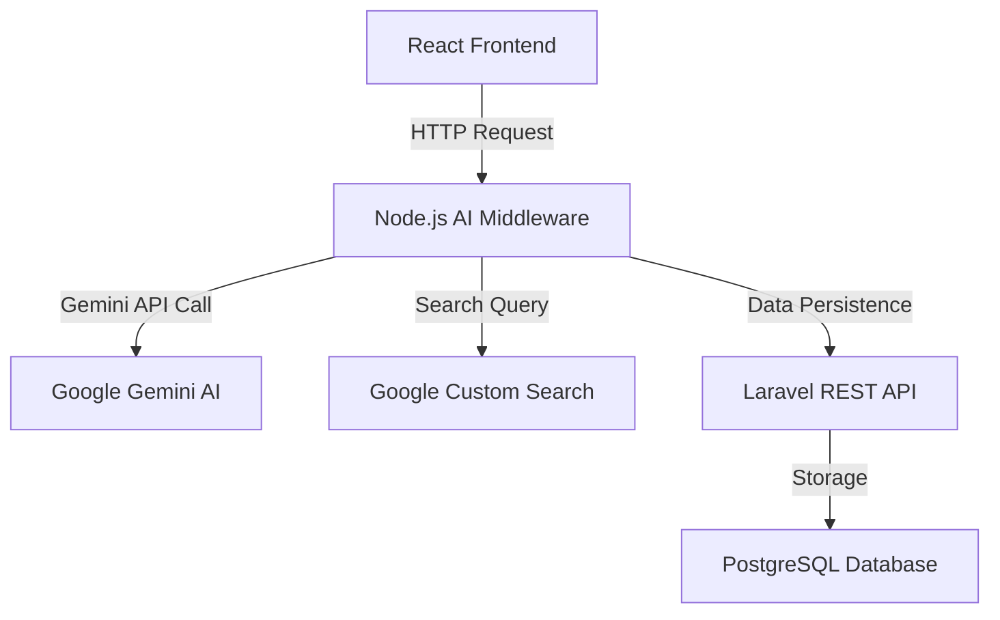
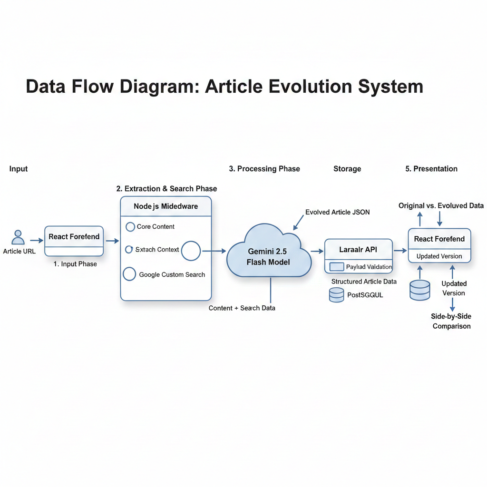

# **AI CONTENT EVOLUTION SYSTEM**

A Full-Stack Multi-Tier Content Transformation Pipeline

## ARCHITECTURE OVERVIEW

The system is designed as a four-tier architecture to ensure separation of concerns, scalability, and robust data management.




## SYSTEM SUMMARY

This project implements an automated pipeline that extracts content from existing web articles and utilizes Generative AI to "evolve" or update that content based on real-time web search results. The processed data is then persisted through a secure backend API for long-term storage and retrieval.


# CORE TECHNOLOGIES

1. **Frontend**: React.js (Vite) for the user interface.

2. **Middleware**: Node.js for orchestrating AI interactions and web searching.

3. **Backend**: Laravel 11 for business logic and API management.

4. **Database**: PostgreSQL 15 for relational data storage.

5. **Orchestration**: Docker and Docker Compose for containerized deployment.

# LOCAL SETUP INSTRUCTIONS

## PREREQUISITES

Ensure that Docker and Docker Compose are installed on your local workstation.

## INSTALLATION STEPS

1. **Clone the Repository**

    
    ```git 
        git clone https://github.com/atultiwari/ai-content-evolution.git
        cd ai-content-evolution
    ```

2. **Environment Configuration**
    Create a .env file in the root directory and populate it with the required keys (refer to .env.example).

3. **Container Orchestration**
    Execute the following command to build and start all services in the background:

    ```bash
        docker-compose up -d --build
    ```

4. **Database Migration**
    Once the containers are active, initialize the database schema by running the Laravel migrations:

    ```bash
        docker exec -it ai_laravel php artisan migrate
    ```
## SERVICE ACCESS POINTS

- **Frontend UI**: http://localhost:5173

- **Laravel API**: http://localhost:8000

- **Node.js Service**: http://localhost:3000

# DATA FLOW ANALYSIS

1. **Input Phase**: The user provides an article URL via the React interface.

2. **Extraction & Search Phase**: The Node.js middleware extracts core content and performs a Google Custom Search to find the latest context.

3. **Processing Phase**: The original content and new search data are sent to the Gemini 2.5 Flash model for synthesis.

4. **Storage Phase**: The evolved article is sent to the Laravel API, which validates the payload and stores it in the PostgreSQL database.

5. **Presentation Phase**: The React frontend retrieves the original and updated versions for side-by-side comparison.

# Data Flow Diagram



## DEPLOYMENT AND SUBMISSION

- **Live Frontend Application**: https://content-evolution.onrender.com/

- **Docker Hub Repository**: https://hub.docker.com/u/atultiwaridocker

## CONFIDENTIALITY AND PUBLIC ACCESS

This repository is configured for public access to facilitate the technical review process. All API keys have been abstracted into environment variables and are not included in the source code.

<br><br><br>


# **TECHNICAL SETUP AND DEPLOYMENT DOCUMENTATION**

</div>

## PROJECT STRUCTURE

The repository is structured as a monolithic project containing three distinct service directories:

- /**frontend**: React.js application utilizing Vite for the user interface.

- /**genAiWithNode**: Node.js middleware responsible for AI orchestration and web scraping.

- /**backend**: Laravel PHP framework providing the RESTful API and database management.

## DOCKER CONFIGURATION

The project utilizes a multi-stage Docker build process to ensure environment parity across all development and production stages.

## FRONTEND CONFIGURATION

Uses Node:20-alpine to serve the React application. The development server is exposed on port 5173 with host-binding enabled to allow external access through the Docker bridge network.

## NODE.JS CONFIGURATION

Uses Node:20-alpine to provide a stable runtime for the Gemini AI SDK. It listens on port 3000 and handles asynchronous tasks including Google Search integration.

## LARAVEL CONFIGURATION

Uses PHP 8.2-FPM with Alpine Linux. The build process includes automated Composer dependency installation and the necessary system libraries for PostgreSQL interaction.

## END-TO-END OPERATIONAL FLOW

To ensure a successful deployment and verification of the system, the following operational sequence must be followed:

- **Environment Initialization**: The user populates the .env file in the root directory.

- **Orchestration**: Docker Compose builds the images and starts the containers.

- **Database Migration**: The Laravel container executes the migration script to prepare the PostgreSQL schema.

- **Ingestion**: A user inputs a URL via the React Frontend.

- **Processing**: * The Node.js service scrapes the URL.

- It triggers a Google Custom Search for updated context.

- It sends combined data to Gemini 2.5 Flash for content evolution.

- **Persistence**: The evolved content is sent to the Laravel API and stored in the PostgreSQL database.

- **Retrieval**: The Frontend queries the API to display the finalized, SEO-optimized result.

# REBUILDING SERVICES

Use the following commands to synchronize the deployment after configuration changes:

## Rebuild a specific service
    
    docker-compose build
    
## Restart all services with volume clearing
    
    docker-compose down -v
    docker-compose up -d
    


## COMMON ERRORS AND SOLUTIONS

1. ### Database Connection Refused

**Error**: Laravel logs show SQLSTATE[08006] [7] could not connect to server: Connection refused.<br>


**Solution**: This typically occurs because the Laravel container attempts to migrate before the PostgreSQL service is fully healthy. Wait 15 seconds after docker-compose up before running php artisan migrate.

2. ### Autoload.php Not Found

**Error**: Laravel container fails to start with a fatal error regarding vendor/autoload.php.<br>


**Solution**: Ensure the composer install command is present in the backend/Dockerfile. If the error persists, run docker-compose build --no-cache backend to force a fresh dependency installation.

3. ### Node.js ReferenceError: File is not defined

**Error**: The ai_node container crashes with ReferenceError: File is not defined.<br>


**Solution**: This indicates the container is using Node.js version 18. Ensure the Dockerfile uses FROM node:20-alpine, as the global File object is required by modern AI SDKs.

4. ### Vite Pre-transform Error (404)

**Error**: Browser console shows Failed to load url /src/main.jsx.<br>


**Solution**: Verify that the file extension in index.html matches the source file (e.g., changing .jsx to .tsx if using TypeScript). Ensure the file path in the <script> tag is exactly /src/main.jsx with a leading slash.

5. ### Nodemon Not Found

**Error**: Node container shows sh: nodemon: not found. \
<br>

**Solutoin**: Update the CMD in the Node Dockerfile to use the direct node engine: CMD ["node", "src/server.js"] instead of a development script relying on external packages.
